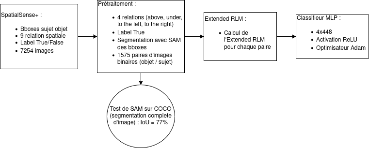
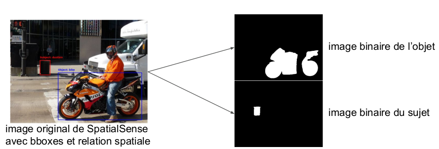
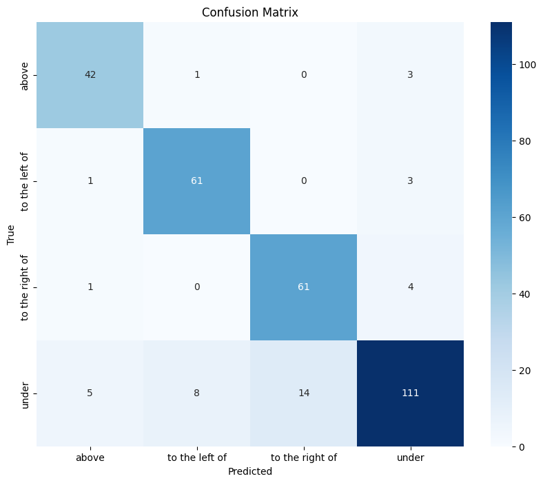

# RLM-MLP

## Description du projet

Ce projet implémente une méthode basée sur des descripteurs de positions relatives, notamment l'Extended Radial Line Model (https://github.com/Logan-wilson/extendedRLM/tree/main), pour modéliser et prédire les relations spatiales entre objets dans des images. Le descripteur est intégré à un classifieurs perceptron multicouches (MLP) pour prédire des relations spatiales.

## Pipeline

1. Segmentation des Objets :

Utilisation de Segment Anything Model (SAM) pour extraire les masques binaires à partir des boîtes englobantes des objets dans le dataset SpatialSense+.

2. Extraction des Descripteurs :

Calcul des descripteurs en passant les paires de masques binaires dans le modèle Extended RLM.

3. Entraînement d'un MLP :

Prédiction des relations spatiales directionnelles en se basant sur les descripteurs.

#### Test complémentaire 

Application de SAM sur le dataset COCO pour évaluer ses capacités de segmentation.

## Notebooks

### Segmentation des images avec SAM

**Description** : Ce notebook utilise SAM pour segmenter les objets à partir des boîtes englobantes des images du dataset SpatialSense+.

**Usage** :

- Fournissez les chemins des images et annotations.
- Obtenez des masques segmentés sauvegardés dans un répertoire donné.

### Prédiction avec RLM + MLP

**Description** : Génère des descripteurs RLM à partir des masques binaires et entraîne un MLP pour prédire les relations spatiales directionnelles.

**Usage** : 
- Chargement des masques segmentés.
- Calcul de l'Extended RLM pour chaques images.
- Entraînement du MLP.
- Evaluation du MLP.

### Test de SAM sur COCO

**Description** : Évalue les performances de SAM sur des images du dataset COCO en termes de segmentation.

**Usage** : 
- Charge les images annotées COCO.
- Segmentation des images avec SAM.
- Calcul de l'IoU des masques.

## Resultats

